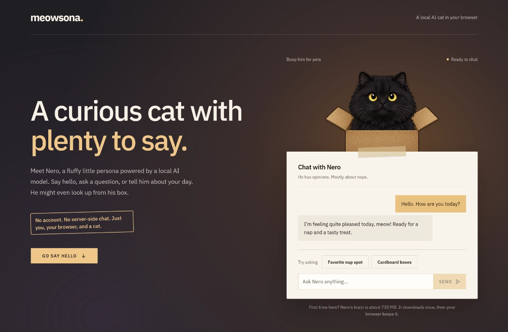

# meowsona



A small demo project: a cat mascot that follows your cursor, reacts when you click it, and chats with you through a language model that runs entirely in the browser.

I built it to try out two things I wanted to learn more about: shipping a UI component as a framework-agnostic web component, and running an LLM locally in the browser instead of calling an API. The app uses [Gemma 3 1B](https://huggingface.co/onnx-community/gemma-3-1b-it-ONNX) as a minimal on-device model, running on WebGPU.

## Structure

The component and the app are kept separate on purpose. The mascot is a plain web component, so it works in React, Vue, Angular or no framework at all. The React app is just one example consumer.

| Path | What it is |
| --- | --- |
| `packages/meowsona` | The `<meowsona-head>` web component, built with Stencil. Renders the cat from a sprite atlas. |
| `packages/react-meowsona` | React wrapper. Adds cursor tracking and the click ("boop") reactions. |
| `apps/web` | Demo site in React, Tailwind and shadcn/ui. Runs [Gemma 3 1B](https://huggingface.co/onnx-community/gemma-3-1b-it-ONNX) in a web worker via Transformers.js. The model tags each reply with an emotion, and the cat changes its expression to match. |

Using the component without a framework (through any bundler, e.g. Vite):

```html
<script type="module">
  import "meowsona";
</script>
<meowsona-head atlas-url="/cat.png" state="happy" size="240"></meowsona-head>
```

## Technology

- **Component:** [Stencil](https://stenciljs.com), with its React output target for the wrapper
- **App:** React 19, TypeScript, Vite, Tailwind CSS 4, shadcn/ui on Base UI
- **AI:** [Transformers.js](https://huggingface.co/docs/transformers.js) running a 4-bit ONNX build of Gemma 3 1B on WebGPU, in a web worker so the UI stays responsive
- **Tooling:** pnpm workspaces, Oxlint, Vitest with Playwright for the component tests

## Running it

Requires Node and pnpm. The chat needs a browser with WebGPU (recent Chrome or Edge).

```bash
pnpm install
pnpm dev
```

The model downloads on first load and is cached by the browser after that.

## Credits

The initial cat mascot image was made with the [page-mascot](https://github.com/nilbuild/page-mascot) AI skill.
